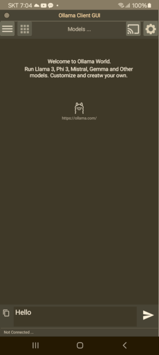
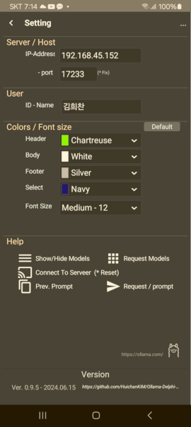
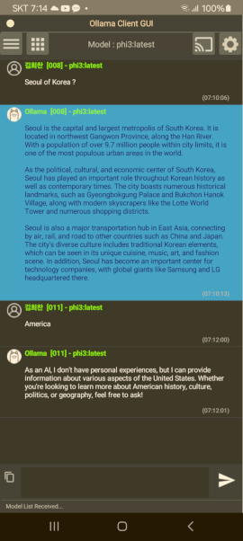
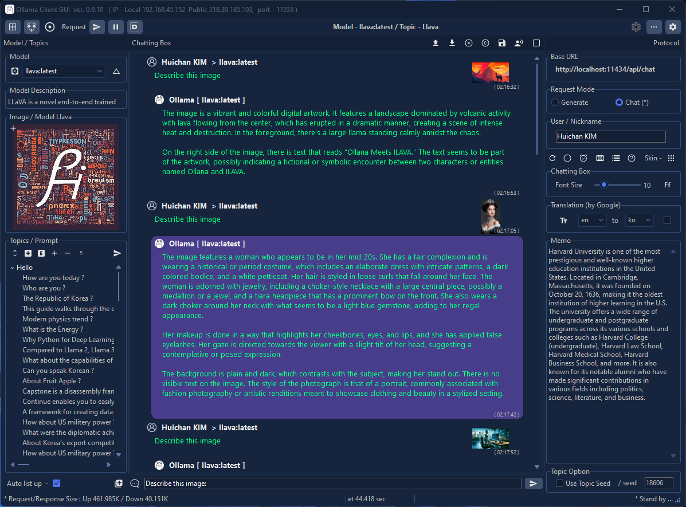

# Ollama-Delphi-GUI

**Latest Version 0.9.11 - 07.01.2024**
- Add a Thumbnail Image to ChattingBox on Llava Model
- Add Broker/Server Functions
- Avoid third-party components as much as possible and 
- make the most of the basic Delphi library.
- Use RESTClient, RESTRequest, RESTResponse as a substitute for OberBytes ICS

- v0.9.9
- If your computer has good performance, 
- use it as a server/broker to connect your Android smartphone

### Features

- Supports Windows 10 and 11 (for 64 bits).

- Themes (Windows10 SlateGray) according to user preferences of Windows Theme

### Prerequisites

 1. Ollama Install ( https://ollama.com/ )
 2. Pull Models (phi3, llama3, gemma, llava, codegemma ...)
 3. Delphi Athens 12.0. over

### 3rd party Library (Open source for Delphi developers) ###

- SVGIconImageList by EtheaDev <https://github.com/EtheaDev/SVGIconImageList>
- DOSCommand by TurboPack <https://github.com/TurboPack/DOSCommand>
- Virtual-TreeView by JAM-Software <https://github.com/JAM-Software/Virtual-TreeView>
- NetCom7 <https://github.com/DelphiBuilder/NetCom7>

### About / Skin / Colors (Screenshot)

 

### Android (Screenshot)

 

### Chattings (Screenshot)

(Skin - Windows10 SlateGray, Windows11 Impressive Dark, Windows11 Modern Dark  )

(Model Llava - Thumbnail view  )

