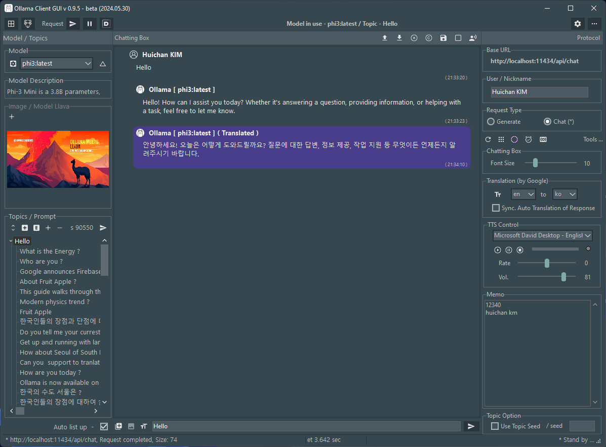

# Ollama-Delphi-GUI

**Latest Version 0.9.4 - 05.29.2024**

- Support Multilingual Translation (by MS SAPI)

### Features

- Supports Windows 10 and 11 (for 64 bits).

- Themes (Windows10 SlateGray) according to user preferences of Windows Theme

### Prerequisites

 1. Ollama Install ( https://ollama.com/ )
 2. Pull Models (phi3, llama3, gemma, llava, codegemma, dolphin-mistral)
 3. Delphi Athens 12.0. over

### 3rd party Library (for Delphi developers) ###

- SVGIconImageList <https://www.markdownguide.org>

- Overbytes ICS <https://wiki.overbyte.eu/wiki/index.php/ICS_Download>

- TMS FNC Core / TMS FNC UI Pack <https://www.tmssoftware.com/site/fnc-products.asp>

### About (Screenshot)

### Chattings (Screenshot)

