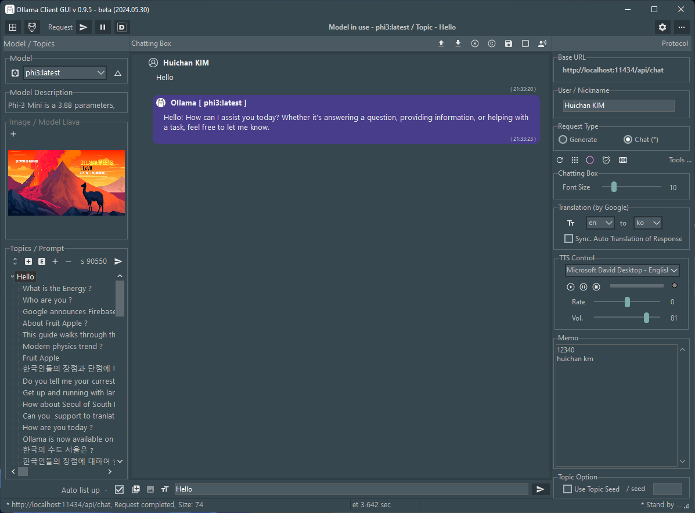

# Ollama-Delphi-GUI

### Latest Version 1.0.5 - 2025.04.20

### Features
- Supports Request-History Manager
- Supports Multimodal Image Analysis (Gemma3, Llava ... ) and Reasoning (Cogito, Deepseek ...)
- Themes (Windows10 SlateGray) according to user preferences of Windows Theme
- Supports Windows 10 and 11 (for 64 bits).
- If your computer has good performance, use it as a server/broker to connect your Android smartphone

### Prerequisites

 1. Ollama Install <https://ollama.com/>
 2. Pull Models (Cogito, Gemma3, Phi4, llama3, gemma, llava ...)
 3. Delphi Athens 12.0. over

### 3rd party Library (Open source for Delphi developers)

- SVGIconImageList by EtheaDev <https://github.com/EtheaDev/SVGIconImageList>
- DOSCommand by TurboPack <https://github.com/TurboPack/DOSCommand>
- Virtual-TreeView by JAM-Software <https://github.com/JAM-Software/Virtual-TreeView>
- NetCom7 <https://github.com/DelphiBuilder/NetCom7>
- EasyJson <https://github.com/tinyBigGAMES/EasyJson>

### About / Skin / Colors (Screenshot)

 

### Android (Screenshot)

 

### Chattings (Screenshot)

### Skin  ( Windows10 SlateGray, Windows11 Impressive Dark, Windows11 Modern Dark  )

### Multimodal ( Gemma3, Llava ...) - Image Analysis

