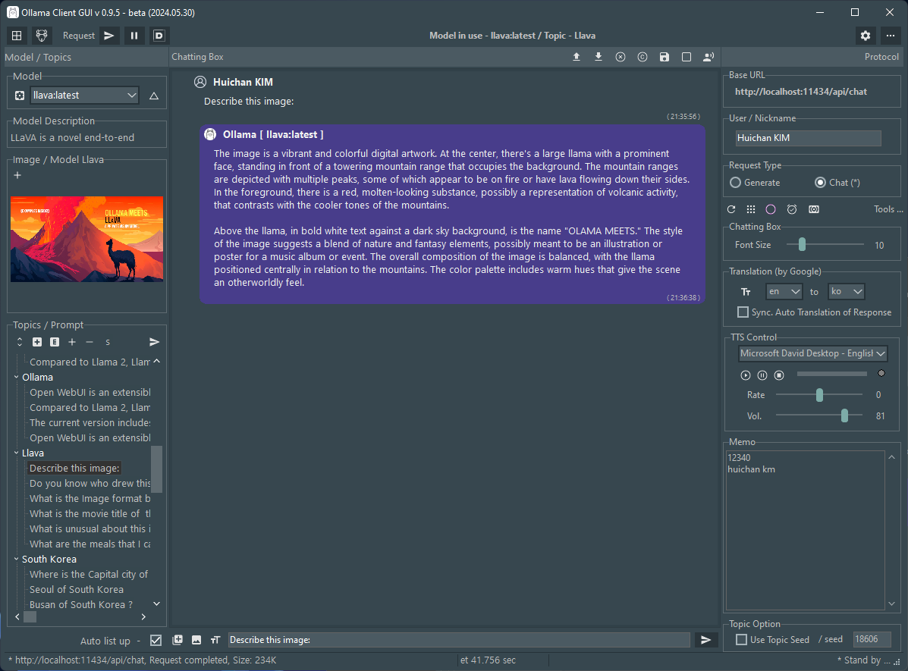

# Ollama-Delphi-GUI

**Latest Version 0.9.6 - 06.05.2024**

Change Default Skin/Style
- Windows10 SlateGray to Windows11 Impressive Dark
- Replace Indy Socket to System.Net.HttpClient (emb.) for Slim.
- Replace Commercial Library to Free Component for ChattingBox
- Support Multilingual Translation (by MS SAPI)
- Support 3 Dark style Skin for UI
- (Windows10 SlateGray, Windows11 Impressive Dark, Windows11 Modern Dark)

### Features

- Supports Windows 10 and 11 (for 64 bits).

- Themes (Windows10 SlateGray) according to user preferences of Windows Theme

### Prerequisites

 1. Ollama Install ( https://ollama.com/ )
 2. Pull Models (phi3, llama3, gemma, llava, codegemma, dolphin-mistral)
 3. Delphi Athens 12.0. over

### 3rd party Library (Open source for Delphi developers) ###

- SVGIconImageList <https://www.markdownguide.org>
- DOSCommand by TurboPack <https://github.com/TurboPack/DOSCommand>
- Virtual-TreeView by JAM-Software <https://github.com/JAM-Software/Virtual-TreeView>

### About / Skin / Colors (Screenshot)

 

### Chattings (Screenshot)

(Skin - Windows10 SlateGray, Windows11 Impressive Dark, Windows11 Modern Dark  )

